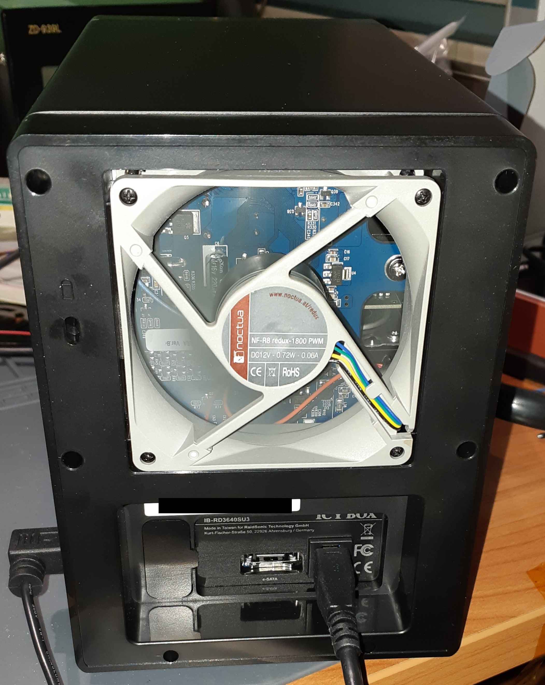

# Icy Box PWM Fan

I recently bought an IB-RD3640SU3 DAS for a RAID5 system.  
It works great so far. The only downside is the super loud fan, so let's fix that.

The original fan is a two wire one, 80x80mm and set to push air in.  
There's an auto and manual mode for the fan so the two wires are just some analog voltage to power the fan on.  
Vary the voltage and you vary the fan speed, easy.  

I still had an 80x80mm Noctua fan left from somewhere else, so I used that.  
It's a 4 wire fan which means it's PWM controlled. I needed something to convert the analog voltage to PWM.  
I still had a PIC16F18325 left so I used that with one of my left over PlayStation reset boards.  
I made a voltage divider with a 15k and 10k so I don't blow up the ADC input.  
Then I programmed the PIC to read the ADC value and write that to the duty cycle of the configured PWM.  

And then when looking for 5V I managed to blow up the PIC. The multimeter said 5V but it actually was some unregulated high frequency voltage...
After replacing it and reprogramming it, everything works fine.

For more info about the code, see the source files. It's really not that big of a project.  
All but the main.c file have been generated by Microchip's Code Configurator which made this so much easier.  

Take a look at the pictures below.  

